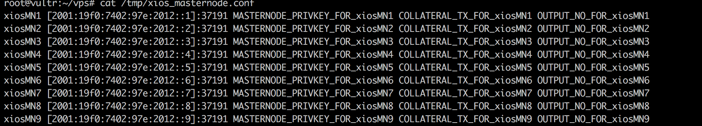

# Slick masternode VPS setup for VIVO - INNA-DASH-PIVX-with-Sentinel-Auto-Install-Cron-Conf masternodes  10 -15 all setup up and cong for YOU including last VIVO night Sentinel Update


Login to your node as "root".


## Masternode script installation

Clone this git repository first:

```
git clone 
https://github.com/luismota/Auto-vps-install---VIVO--INNA-DASH-PIVX-with-Sentinel-Auto-Install-Cron-Conf.git && cd vps


```


## Install the desired masternode and amount

Use the *./install.sh* script with the desired crypto and masternode count as parameters, e.g. to install 1 VIVO masternodes:

```
./install.sh -p vivo -c 1
```

The script downloads, compiles and configures the system now. This will usually take between 5-15 minutes.

The *./install.sh* script outputs a list of possible parameters if executed without options.

## End of installation

The script will output lots of boring stuff and it's ascii banner when done. Your only real work begins now.


## Masternode configuration files

The generated configuration files are located at /etc/masternodes/. One file per masternode and crypto.


## Insert your masternode private key

In 99% you can use the generated settings as is. The only value you MUST change is the masternode private key, generated in your controller wallet. Contact the individual crypto community if unsure, although the steps are identical for most master node coins. Check the [Dash documentation for example](https://dashpay.atlassian.net/wiki/spaces/DOC/pages/1867877/Start+multiple+masternodes+from+one+wallet+start-many).


## Start your new masternodes

A script to enable masternode start at boot has been created at */usr/local/bin/activate_masternodes_${CODENAME}.sh* for your convenience. There is exactly one script per installed masternode crypto.

Run it after you finished configuration, e.g. after a PIVX installation do.

```
/usr/local/bin/activate_masternodes_pivx
```     

## Last step, the controller

To activate the new nodes in your _local_ (not the VPS) controller wallet, add the bind address entries with port to a file called "masternode.conf" as usual.

     MN1 [2002:470:1111:1a4:51]:51472 KEY TX OUTPUT
     MN2 [2003:470:1111:1a4:52]:51472 KEY TX OUTPUT
     MN3 [2003:470:1111:1a4:53]:51472 KEY TX OUTPUT

To make this a bit easier for large installations, i implemented a small gimmick in the newest version. Now after the script has run, a partial of the "masternode.conf" file is generated and placed on the VPS eg for XIOS at "/tmp/pivx_masternode.conf"

So you can take the contents from there and paste it into your local controller-wallets masternode.conf all that you need to add is the relevant pieces from "masternode outputs"



You get the idea, another step to a fully automated setup... ;-)

## Troubleshooting the masternode on the VPS

If you want to check the status of your masternode, the best way is currently running the cli e.g. via

```
/usr/local/bin/mue-cli -conf=/etc/masternodes/vivo_n1.conf getinfo

{
  "version": 1000302,
  "protocolversion": 70701,
  "walletversion": 61000,
  "balance": 0.00000000,
  "privatesend_balance": 0.00000000,
  "blocks": 209481,
  "timeoffset": 0,
  "connections": 5,
  "proxy": "",
  "difficulty": 42882.54964804553,
  "testnet": false,
  "keypoololdest": 1511380627,
  "keypoolsize": 1001,
  "paytxfee": 0.00000000,
  "relayfee": 0.00010000,
  "errors": ""
}
```


# Issues and Questions
Im here to help

If You Feel to get me a redbull i can stay awake more time :)

TIP ME Some VIVO to:
```
VYdyieMgjSxJxGtZnPShqsYj7oz7Nd9ZDH

```
